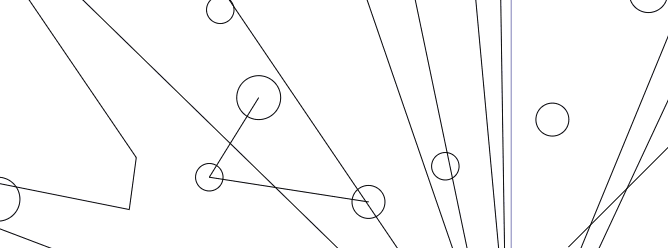

# undo-redo
How to code a drawing undo/redo feature.

An undo/redo drawing feature from scratch, step by step and with a really cool and innovative bonus

The principle is well known so there's no need to describe it. Let's just remember that we're in the special environment of an SVG editor here, and that undo/redo operations apply to to graphical entities, lines, circles, paths and so on.

A glimpse in action :



## Drawing action

If you want to undo a modification to a entity, you must of course have stored the entity's state before the modification. And if you want to restore an undone modification, you must first have stored the entity's modified state.

Let's set up a **DrawingAction** class designed to store the modification of an entity, i.e. both its "**prevState**" state before modification and its "**nextState**" state after modification. We also store "**entity**", a pointer to the entity itself, so we can change its state right here by applying "**prevState**" or "**nextState**" as appropriate.

```typescript
export class DrawingAction {
    entity: any;
    prevState: any;
    nextState: any;
    status: UndoStateEnum = UndoStateEnum.pending;
}
```

To reverse a state, you need to know "**status**" of the current state. I use a "**UndoStateEnum**" enum that lets me know whether the modification is in progress, undone or restored:

```typescript
export enum UndoStateEnum {
    pending = 0,
    restored,
    undone
}
```

### Starting an update

A **DrawingAction** is created when a modification action begins. A [service](#undo service), which we'll see a little later, receives the storage request and generates as many **DrawingActions** as there are selected entities to be modified.

```typescript
export class DrawingAction {
	...
    cudOp: UndoCUDOpEnum;
    
    constructor(e: any, cudOp: UndoCUDOpEnum) { 
        this.entity = e;
        this.cudOp = cudOp;
        this.prevState = this.cloneState(e);
    }
}
```

The ctor receives the entity, which is of type any. I could have given it the base type of my entities but I preferred to keep it generic at this stage, as this can be used in different contexts. The "**cudOp**" indicates the type of CUD (Create, Update, Delete) operation started on the selected entities. We need this information because it's not the same thing to restore the position of an entity as to reinsert it if it has been deleted or to delete it if it has been created.

Here too I use an enumeration :

```typescript
export enum UndoCUDOpEnum {
    update = 0,
    create,
    delete
}
```

The **DrawingAction** ctor initializes the current state "**prevState**" with a clone of the entity.

```typescript
private cloneState(e: any): any {
    return JSON.parse(JSON.stringify(e));
}
```

"**prevState**" may seem a rather inappropriate name for the current state, but it must be remembered that when an undo operation is performed, the two states "**prevState**" and "**nextState**" will have been exchanged and "**prevState**" will effectively correspond to the state preceding the undo operation.

### Ending an update

When a modification operation is complete, the [service](#undo service) set the new state of the entities for each **DrawingAction** :

```typescript
store(e: any): boolean {
    this.nextState = this.cloneState(e);
    this.status = UndoStateEnum.restored;
    // return false if the entity has no changes
    return prevState !== this.nextState;
}
```

We clone the state of the modified entity as we did for **prevState** in the constructor. For example, **status**, which was **UndoStateEnum.pending** in the constructor, becomes **UndoStateEnum.restored**. Restored because there is no difference between a current state after a modification and a restored state after a redo. This is the same name ambiguity we saw above with **prevState**..

Why is it necessary to pass `(e: any)` to the **push** function since entity has already been stored at initialisation. Remember it's a pointer, so its state is the modified state. We could just as easily do `this.nextState = this.cloneState(this.entity);` couldn't we? Well, no, because in the case of an insertion operation, the entity doesn't yet exist when **DrawingAction** is initialised. **entity** and **prevState** are undefined. And here, conversely, it's during a delete operation that **e** and **nextState** are undefined, because at that point the entity no longer exists..

This function returns false if the two states are identical. This indicates that the entity has not been modified, which occurs if the modification operation has been cancelled by the user before being completed. This return value allows the [service](#undo service) to know whether it should keep the **DrawingAction** or not.

### Undoing / redoing

Finally, we still have to write the two methods undo and redo, which is quite straightforward, as all we have to do is swap the two states and change the status.

```typescript
undo(): void {
    this.switchState(UndoStateEnum.undone);
}

redo(): void {
    this.switchState(UndoStateEnum.restored);
}

private switchState(status: UndoStateEnum): void {
    const tmp = this.prevState;
    // This is a straightforward but unsafe approach. We may loose nested types. 
    // For production purposes, it should be replaced by a deep cloning method.
    Object.assign(this.entity, this.prevState);
    this.prevState = this.nextState;
    this.nextState = tmp;
    this.status = status;
}
```

## Undo service

Let's move on to the service that manages the stock flow.

**UndoService** is a store for the successive states of modified entities and allows these states to be scrolled forwards or backwards.

The sequence of successive states of the entities is like a stop-motion film. Undo means playing the film backwards. Redo means playing it forwards again. Undo stops when there are no more operations to undo, i.e. when you are on the first frame. Redo stops when there are no more actions to restore, i.e. when you are on the last frame.

The service is initialized in the parent model, which imposes a maximum number of operations to be recorded. Passing this parameter to the constructor allows you, if you wish, to make it an adjustable input parameter.

```typescript
export class UndoService {
	...
    maxActions: number;

    constructor(maxActions: number) {
        this.maxActions = maxActions;
    }
}
```

### Recording actions

When modifications are started, the service receives a request to initialise storage. The service uses two tables, one for temporary storage until the modification actions have been completed, "**pending**", and one for permanent storage once the modification has been completed, "**actions**".

The service creates a **DrawingAction** for each entity being modified. When the modification is a creation or a deletion, the action is immediately completed and placed in the **actions** array, otherwise it is placed in the **pending** temporary array. Note that the **storeAction** method ensures that the actions array does not exceed the size limit declared when the service was initialized.

```typescript
actions: DrawingAction[] = [];
pending: DrawingAction[] = [];

start(es: SelectableSvgEntity[], cudOp: UndoCUDOpEnum = UndoCUDOpEnum.update): void {
    // store a temp array of entities current state
    es.forEach(e => {
        const newAction = new DrawingAction(e, cudOp);
        if (cudOp !== UndoCUDOpEnum.update) {
            // occurs when an entity is inserted or deleted
            // in this case, the action is immediately stored
            newAction.store(e);
            this.storeAction(newAction);
        } else {
            this.pending.push(newAction);
        }
    });
}

private storeAction(a: DrawingAction): void {
    // move pending action to effective action
    this.actions.push(a);
    // drop first action if reach maximum storage
    this.checkMax();
}

private checkMax(): void {
    if (this.actions.length > this.maxActions) {
        this.actions = this.actions.slice(1);
    }
}
```

When the modifications are complete, the service receives a request for definitive storage and the temporary table is cleaned out. Of course, this method is never used to create or delete entities.

```typescript
store(es: SelectableSvgEntity[]): void {
    // store the entities new state
    es.forEach(e => {
        // entity should be found in temp array
        const a = this.pending.find(x=> x.entity.entityId === e.entityId);
        if (a) {
            // store the new entity state if entity has changes
            if (a.store(e)) {
                this.storeAction(a);
            }
        }
    });
    // clear temp array
    this.pending = [];
}
```

If the user cancels the modification he is currently making, the service receives a cancellation request and empties the temporary table.

```typescript
abort(): void {
    // update abort, clear temp array
    this.pending = [];
}
```

### Rewind to undo

As we have seen, undoing is like playing the modification film backwards. To find out if there are any images left to rewind, we filter actions by their **UndoStateEnum** status. This gives you a sort of cursor position on the timeline.

```typescript
undoLast(ids?: string[]): void {
    const undoable = this.undoable(ids);
    // may be there is no more action to undo
    if (undoable.length === 0) return;
    const last = undoable[undoable.length - 1];
    switch (last.cudOp) {
        case UndoCUDOpEnum.create:
            if (this.deleteRequested) this.deleteRequested(last.entity.entityId);
            break;
            case UndoCUDOpEnum.delete:
            if (this.createRequested) this.createRequested(last.entity);
            break;
    }
    last.undo();
}

private undoable(ids?: string[]): DrawingAction[] {
    return this.able(UndoStateEnum.restored, ids);
}

private able(status: UndoStateEnum, ids?: string[]): DrawingAction[] {
    if (ids && ids.length > 0) {
        return this.actions.filter(x=> ids.includes(x.entity.entityId) && x.status === status);
    }
    return this.actions.filter(x=> x.status === status);
}
```

If the action to be undone is of type **UndoCUDOpEnum.update**, there's no problem, it's simply a matter of inverting the states of the **DrawingAction**, it's the `last.undo()` instruction. On the other hand, if the modification is of type **UndoCUDOpEnum.create** or **UndoCUDOpEnum.delete**, the service cannot handle the state inversion, as the entity must either be reinserted into the drawing or deleted. The only thing the service can do is send a request to update the drawing. This request is listened to by the parent model, which performs the operation.

The service calls a function which acts as an event. It is not defined in the service, but by the parent model, which therefore listens to it in some way.

```typescript
// UndoService side
createRequested?: (state: any) => void;
deleteRequested?: (id: string) => void;

// parent model side
this.undoService = new UndoService(100);
this.undoService.createRequested = (entity: any) => {
    // instructions to insert entity in the drawing
    this.drawing.insert(entity);
}
this.undoService.deleteRequested = (id: string) => {
    // instructions to remove entity from the drawing
    const i = this.drawing.entities.findIndex(x=> x.entityId === id);
    this.drawing.entities.splice(i, 1);
}
```

### Forward to redo

Nothing in particular to say here. The film is replayed right side up from the current position. It's exactly the same principle as for undo.

```typescript
redoLast(ids?: string[]): void {
    const redoable = this.redoable(ids);
    // may be ther is no more action to redo
    if (redoable.length === 0) return;
    // undo is backward, redo is forward, so we take the first
    const first = redoable[0];
    switch (first.cudOp) {
        case UndoCUDOpEnum.create:
            if (this.createRequested) this.createRequested(first.entity);
            break;
            case UndoCUDOpEnum.delete:
            if (this.deleteRequested) this.deleteRequested(first.entity.entityId);
            break;
    }
    first.redo();
}

private redoable(ids?: string[]): DrawingAction[] {
    return this.able(UndoStateEnum.undone, ids);
}
```

## To sum up

You see, it takes surprisingly few codes to achieve this feature. Frankly, I expected it to be a lot more complicated when I began working on it.

You can find the whole thing on the github repo.

## Super bonus

Let's take a look at this little bonus that I've been dangling in front of you all along.

One thing that often annoys me when I'm drawing is when I realize that I shouldn't have, say, moved these elements a little earlier. To go back, I then have to undo everything I've done since, which I don't want to do. And I'm forced to work around the problem by taking a copy of the elements whose state I'd like to recover after reverting. But this is sometimes too complicated and just as annoying as losing unsaved changes.

It's a pity that it's not possible to undo only operations concerning specific entities 😁.

Yes, you guessed it, that's the super bonus!

You may have wondered why the **undoLast** and **redoLast** methods expect an array of `ids: string[]` identifiers. And indeed, it seems pointless, since the service already knows which entities are present on the movie. Well, this way it becomes possible to apply forward or reverse state changes to only some of them.

How does it work? If no entities are selected on the drawing, then **undo** or **redo** apply to all actions recorded in **UndoService**. If one or more entities are selected on the drawing, only these will be affected.

A killer feature, isn't it ? And almost code free, watch it in action !

------

Check also by my [code crumbs](https://code-crumbs.pplaissy.fr/) blog.
